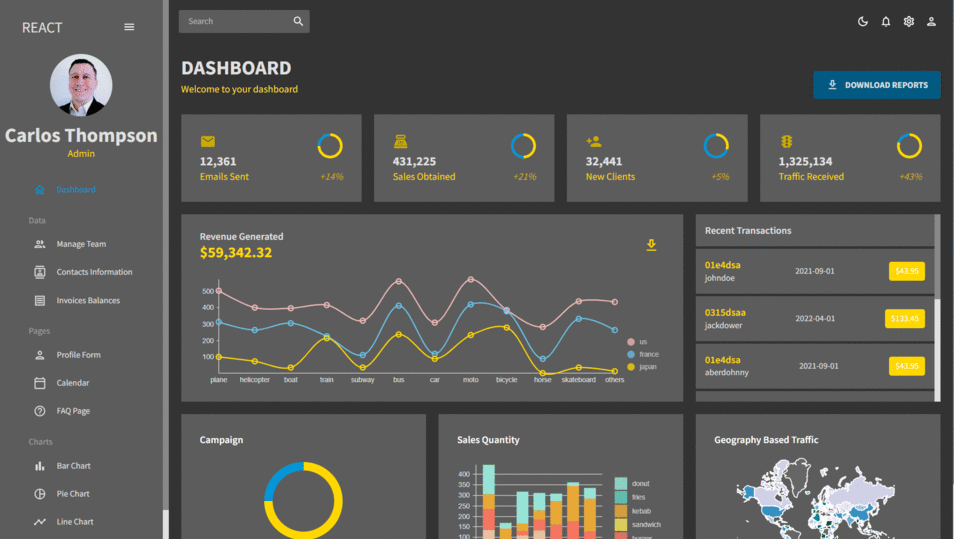

# React Dashboard

## 📜Description
This is a project about how Building Modern Dashboard with React to learn and practice React.js knowledge, following this excellent instructor: @EdRohDevusing.  

## 🔨 Technologies and Tools:  
* React 
* Material UI
* Nivo Charts
* Formik, Yup
* FullCalendar
* Data Grid   

## 🔗 Reference

@EdRohDev: https://www.youtube.com/@EdRohDev.